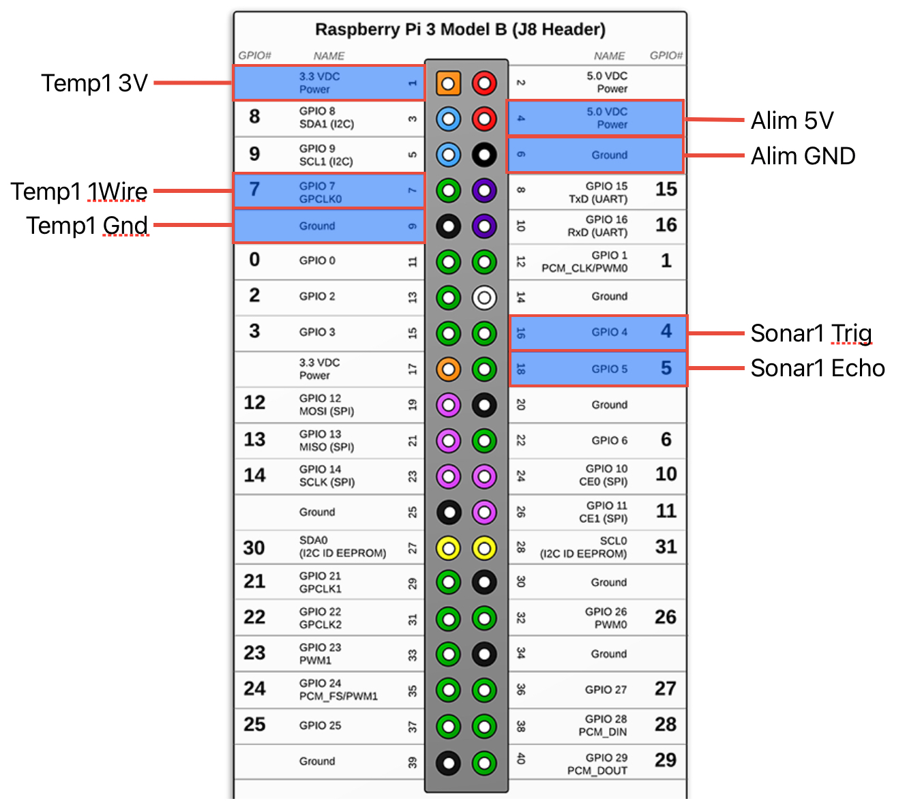

# Hydroponie
Controle d'un système Hydroponie.

Le module central de contrôle du système est un Raspberry Pi modèle 3 B. Il est alimenté par une alimentation externe 5v 3A.

## Installation du RaspberryPi
Réaliser un un update et un upgrade

```
sudo apt-get update && sudo apt-get upgrade
```

Activer l'interface 1-Wire sur le Raspberry Pi
```
sudo raspi-config
```

Installer Docker
```
curl -sSL https://get.docker.com | sh
sudo usermod -aG docker $USER
logout
```

Installer git
```
sudo apt install git
```

Cloner le repo git
```
git clone https://github.com/gregoryvanko/Hydroponie.git Docker
```

Créer et exécuter le container
```
docker compose up -d
```

## GPIO du Raspberry Pi


## Mesure de la temperature
Pour mesurer la temperature, on utilise une sonde ds18b20.
 
Il faut activer l'interface 1-Wire sur le raspberrypi via la commande:
```
sudo raspi-config
```

La mesure se fait via un package NodeRed (il est installé automatiquement lors de la création du container docker) :
```
node-red-contrib-ds18b20
```

## Mesure du niveau d'eau par ultrason
Pour utiliser le module ultrason, on utilise une sonde SRF04.
 
Un script python permet de réaliser une mesure de distance via la sonde. Ce script est exécuté via NodeRed.

La librairie python suivante est nécessaire pour faire fonctionner le script (elle est installée automatiquement lors de la création du container docker) :
```
sudo apt install python3-RPi.GPIO
```

Les deux GPIO du module ultrason se configurent dans le fichier .env a sauver sur le Raspberry Pi :
```
PIN_TRIG=16
PIN_ECHO=18
```

Les distances entre le capteur à ultrason et le niveau d'eau le plus bas (SONAR_MAX) / le plus haut (SONAR_MIN) doivent etre définies dans le fichier .env a sauver sur le Raspberry PI :
```
SONAR_MAX=72
SONAR_MIN=7
```

## CloudFlared
Pour se connecter au Raspberry Pi depuis internet on va créer un tunnel via CloudFlare.

Il faut configurer un tunnel dans Claudflare et sauver le token communiqué par ClaudFlare dans le fichier .env à sauver sur le Raspberry PI.
```
CLOUDFLARED_TOKEN=djyugricbd...
```

## Le fichier .env du a créer sur le Raspberry Pi :
```
PIN_TRIG=16
PIN_ECHO=18
SONAR_MAX=72
SONAR_MIN=7
CLOUDFLARED_TOKEN=djyugricbd...
```

# Update
Ajouter les nouveau package NodeRed à installer dans le fichier NodeRed/Configuration/dockerfile en y copiant la ligne suivante : 
```
RUN npm install xxx
```
Copier le nouveau fichier flows.json sous NodeRed/Data

